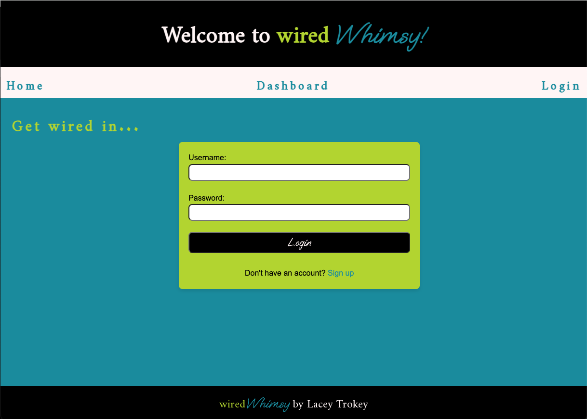
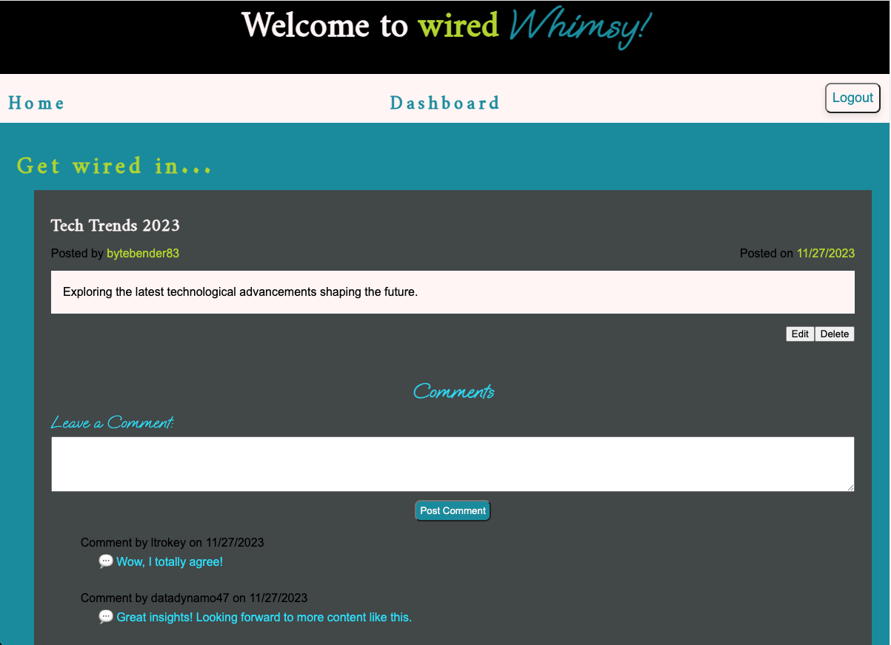
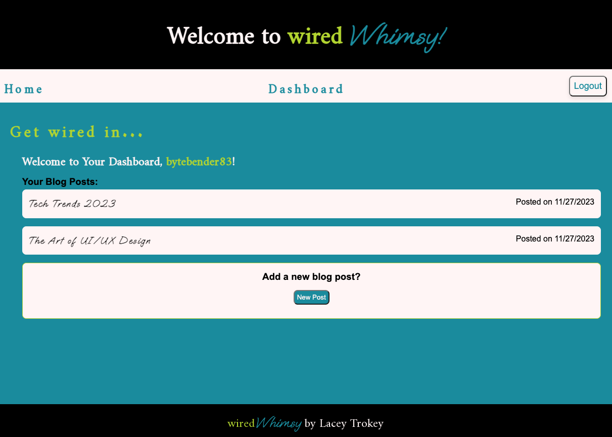
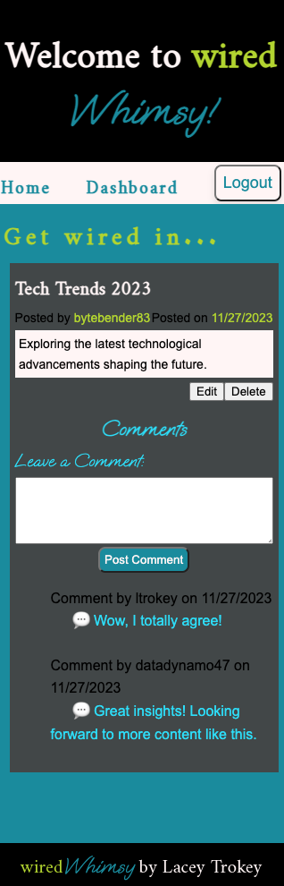

# wiredWhimsy - MVC Tech Blog

[](https://opensource.org/licenses/MIT)

[Link to live deploy](https://wiredwhimsy-565439fb63e5.herokuapp.com/)

## Description

Welcome to the wiredWhimsy, your ultimate destination for tech enthusiasts and developers alike. This CMS-style blog site is meticulously crafted to provide a seamless and feature-rich experience for individuals passionate about technology. This application is crafted with the MVC (Model-View-Controller) architecture, ensuring a scalable, organized, and maintainable structure.

## Table of Contents

- [Installation](#installation)
- [Usage](#usage)
- [Badges](#badges)
- [Features](#features)
- [Questions](#questions)

## Installation

1. **Clone the Repository**
   ```
   git clone https://github.com/your/repository.git
   cd mvc_tech_blog
   ```
2. **Install Dependencies**

   ```
   npm i
   ```

   **Dependencies**

   - This application utilizes Node.js along with the following key dependencies:

   ```
    mysql: ^2.18.1
    npm i express
    npm i express-handlebars
    npm i express-session
    npm i connect-session-sequelize
    npm i sequelize
    npm i mysql2
    npm i dotenv
    npm i bcrypt
   ```

3. **Database Setup**

   - Schema Creation: Run the schema.sql file provided in the db directory to create the necessary tables for the application. You can execute this SQL script in your MySQL environment directly or use commands like:

   ```
    mysql -u your_username -p

    < source db/schema.sql
   ```

   - Seed Initial Data (exit MySQL):

   ```
    npm run seed
   ```

4. **Configuration**
   - Update the connection settings in the config/connection.js & .env file to match your MySQL database credentials.

## Usage

1. Run the Application

   - After following the installation instructions, execute the application by running the following command:

   ```
   npm start || nodemon server.js
   ```

2. Application Instructions:

   - Sign-Up or Login: Begin your journey by creating a secure account, establishing your unique presence on the Tech Blog.

     

   - Explore: Dive into the homepage, where a curated selection of tech-related blog posts awaits. Navigate with ease, thanks to user-friendly navigation links.

     

   - Create: Express your thoughts and expertise by crafting insightful blog posts. The intuitive content creation process ensures that your ideas take center stage.

     

   - Engage: Encourage conversations by leaving comments on posts. Connect with like-minded individuals and expand your network within the tech community.

   - Manage: Your dashboard is a powerful tool for post management. Effortlessly update existing posts to reflect the latest developments or remove outdated content.

     

   - Logout: When your session concludes, log out securely, knowing that your account and content are protected.

   - Mobile Friendly

     

     

     

## Badges


## Features:

1. Express.js for Robust Backend:

   Fast and Scalable: Our blog utilizes Express.js, a fast and minimal web application framework for Node.js, serving as the backbone of our MVC architecture. This ensures that your blog is not only responsive but also capable of handling a growing number of users and content.

2. Dynamic Views with Handlebars:

   Expressive Templates: The blog's frontend, represented by the "View" in MVC, is crafted using Handlebars, a powerful templating engine. This allows for the creation of dynamic and expressive views, ensuring a visually appealing and user-friendly interface.

3. Secure User Authentication with Bcrypt:

   Hashed Passwords: User security is my top priority. I employed the bcrypt library to hash and salt passwords, enhancing the protection of user credentials. This functionality is encapsulated within the "Model" layer of MVC, ensuring a clean and modular codebase.

4. Session Management for a Seamless Experience:

   Persistent Sessions: I implemented session management, a key aspect of the "Controller" layer in MVC, to provide a seamless user experience. Once logged in, users can navigate the blog without repeated authentication, enhancing convenience without compromising security.

5. Database Management with Sequelize:

   ORM Functionality: Representing the "Model" layer, Sequelize, a powerful Object-Relational Mapping (ORM) tool, is employed to interact with the database. This allows for efficient data storage, retrieval, and management, ensuring the reliability and integrity of your blog's content.

6. Intuitive Content Management: CRUD

   Create, Read, Update, Delete: The blog provides an intuitive dashboard, or "Controller" layer, for managing your content. Easily create, edit, or delete blog posts with just a few clicks. The user-friendly interface ensures that you can focus on what matters most—your content.

7. Commenting System for Engaging Conversations:

   Interact with Readers: Foster a community around your content with our built-in commenting system, an extension of the "Model" layer. Engage in meaningful conversations with your readers, creating a space for discussion and collaboration.

## Questions

[GitHub Profile](https://github.com/ltrokey)

Please feel free to contact me via the email link below.

[Email](mailto:trokeyln@gmail.com)
